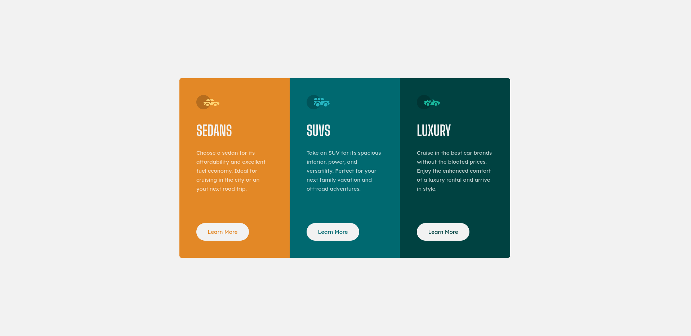

# Exercício 10 | 3-column preview card component

## Aplicando tecnicas de Flexbox, grid e responsividade

Exercício simples mas divertido de se fazer

<a href="https://lucasramosfs.github.io/projeto10-3-column-preview-card-component/ "> Clique aqui para acessar a página</a>

### Resultado final

